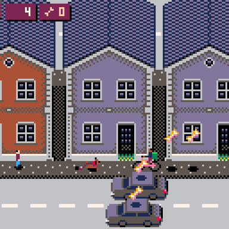

# Unleashed (Pico8 game)

Unleashed is a casual infinite runner created for the [Pico8](https://www.lexaloffle.com/pico-8.php). As the player, you are a dog that is running away from its owner, who is trying to catch you. If he catches you, then it's game over and you have to start again. The further you run away before getting caught, and the more bones you manage to collect along the way, the higher your score.

## Demo

Here is a small demo where you can see the dog running, dodging obstacles, collecting bones, and eventually getting caught by its owner after colliding with a car:

## How to play

### 1. Online

You can try it out online [here](https://www.lexaloffle.com/bbs/cart_info.php?cid=unleashed).

### 2. Cartridge

Here is the cartridge for the game, which can actually be downloaded and played in the Pico8:

P.S. Yes, this PNG image contains the entire game. Pretty neat if you ask me. 😎

## About this project

Developing this game was a lot of fun! The limitations of the Pico8, technical and otherwise, make developing for this [fantasy console](https://en.wikipedia.org/wiki/Fantasy_video_game_console) a very entertaining challenge. Plus, I personally find the retro aesthetic of the IDE and the game(s) very cool and charming. That said, this game is kind of a disaster, and probably a good example of what not to do in many ways.

First of all, it isn't as fun to play as I would have hoped, and it often feels a little bit weird or even buggy. And that's not a coincidence, because the code is an absolute atrocity, as well as the reason why, by the end of development, I pretty much hated my own creation. 🙈

As anyone can see, the game itself isn't that complex (it's quite simple, actually), but little by little its code grew into a convoluted mess that ended up occupying more than 8k tokens – I didn't even try to be mindful of the number of tokens because I naively assumed that I would never need them all, yet here we are.

Part of the problem was that I knew/know very little about Lua and Pico8, which was made worse by the fact that I am too lazy to learn things properly, as I prefer to just wing it. However, apart from my own incompetence, I believe that the main issue was that the project changed directions a hundred times during development, resulting in the messy outcome you see here.

In any case, enough with the negatives. As I mentioned at the start, working on this project was a blast, so I might come back to the Pico8 in the future with some fresh ideas and some lessons learned.
